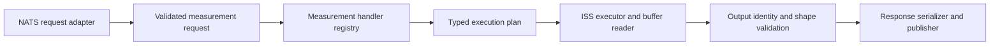

# Refactor preparation review — 2026-09-25

**Updated 2026-09-27:** reviewed the cloned `instrument-data` and `instrument-call-stack` repositories and their integration with the newer hub checkout. The update below supersedes conflicting recommendations in the original review, retained afterward as historical evidence.

The refactor should establish trustworthy measurement behavior as well as smaller files. The newer checkout has made progress on composition, buffer access, and routing; individual measurement implementations and native-library contracts still need validation. Agree on input, output, units, and failure contracts with the primary developer before carrying legacy behavior into individual handlers.

## Update — native buffers and Lua call stacks, 2026-09-27

### Repositories and evidence

| Repository | Reviewed revision | Relationship to the hub build |
| --- | --- | --- |
| `falcon-instrument-hub` | `450f15d` | Newer than the original review's `074750b`; includes the native buffer manager, dispatcher, and router. |
| `instrument-data` | `053205f` | Project version `1.1.8`; differs from tag `v1.1.8` only in `CMakeLists.txt`. The reviewed C implementation matches that tag. |
| `instrument-call-stack` | `6c34897` | Exactly tag `v1.0.6`, which the hub port selects. |
| `instrument-script-server` | `6df4b1c` | Reviewed to trace Lua injection, dispatch, and result serialization. The hub selects `v2.0.24`; this clone's HEAD differs from that tag. Integration observations below concern the reviewed source, not verified behavior of the installed daemon. |

The hub's [instrument-data port](../ports/instrument-data/portfile.cmake) and [instrument-call-stack port](../ports/instrument-call-stack/portfile.cmake) download versioned archives. Cloning or editing a sibling repository does **not** automatically change the libraries used by `make test`. Use explicit development overrides or updated release pins when testing native changes, and record the linked versions. Sibling source links below assume the repositories remain alongside the hub.

The supplied `make_test_out.txt` remains evidence for the earlier checkout. Its missing-package and old-client failures should not be reported as current failures. This update's compile-only checks passed for the five integration packages listed under verification.

### What has changed in the hub

- [Production dependency wiring](../runtime/cmd/dependancies.go) now constructs the concrete ISS client and asserts its interface. The original missing-factory finding is resolved in source.
- [The measurement adapter](../runtime/internal/handlers/measure/measure_command_handler.go) now constructs a native buffer manager, dispatcher, and router. [The router](../runtime/internal/interpreter/router.go) defines the individual-handler boundary, but its production handler list is empty. Requests reaching it currently receive `no measurement handler matched request`. Registering and validating the first operation remains an implementation step.
- The former monolithic handler is now commented reference code in [measure_command_handler_old.go](../runtime/internal/interpreter/measure_command_handler_old.go). Its cached-value and positional-result fallbacks are migration hazards, not proof of reachable behavior in the new router.
- The missing-package buffer extraction has been replaced by [buffer.go](../runtime/internal/databuffer/buffer.go) and [buffer_management.go](../runtime/internal/databuffer/buffer_management.go). Direct `instrument-data` use is already implemented; the review should now focus on ownership and integration.
- Some earlier findings remain visible: [startup](../runtime/cmd/main.go) still starts ISS under `!AutoStart` and supplies an empty instrument API path list; [the client](../runtime/internal/instrumentserver/client.go) still dereferences the job-status response before checking the RPC error. The new libraries do not resolve these independently.

This update focuses on the two native dependencies and their immediate integration. It is not a fresh reproduction of every historical finding.

### `instrument-data`: use it for typed buffer storage and access

The primary-developer FIX to use `instrument-data` directly is supported by the actual API. Its [public header](../../instrument-data/include/instrument-data.h) provides creation, attachment by ID, a native data pointer, element count, element type, metadata, and release. Supported types are `float32`, `float64`, `int32`, `int64`, `uint32`, `uint64`, and `uint8`. Shared metadata includes byte size, instrument/command provenance, timestamp, and process ownership. It does **not** define multidimensional shape, axis labels, calibration, or physical units.

The current Go wrapper uses cgo and `pkg-config: instrument-data`; its manager preserves typed slices rather than forcing everything into `[]float64`. Keep ISS responsible for job execution and release of its ownership, and keep native mapping/type/lifetime handling in the buffer package.

The intended handoff in `RegisterBuffer` is sensible: attach the hub, obtain metadata, then ask ISS to release its ownership. That handoff needs a verified native lifetime contract before being treated as safe. Hub and producer must share the relevant shared-memory namespace; an ID returned from a daemon on another machine is not a transferable array payload.

**Current integration findings:**

| Priority | Source-confirmed issue | Required change or acceptance evidence |
| --- | --- | --- |
| P1 | Scalar buffer returns are skipped by registration. ISS serializes a buffer as a protobuf string with `LUA_TYPES_DATA_BUFFER`. The hub's `measureJobResultToCallResults` ignores that declared type, and `fromGrpcVariableValue` returns a plain Go `string`. The dispatcher registers only `instrumentserver.DataBuffer` or `DataBufferArray`. | Decode the value together with its declared type. Test protobuf result → client → dispatcher, proving that a scalar buffer is registered and an ordinary string is not. Mocking an already-typed `DataBuffer` bypasses this defect. |
| P1 | `ReadBuffer` returns `unsafe.Slice` views into native memory. Its read lock ends before the caller consumes them; `ReleaseBuffer`/`ReleaseRequestor` can subsequently release the mapping. Current native reference leaks may mask this lifetime defect. | Prefer an owned Go copy initially, or expose an explicit lease that remains held while views are in use. Define ownership through response serialization/publication. |
| P1 | Native slices use the C element count without verifying byte-size consistency, integer conversion limits, or agreement with ISS metadata. The ISS client also discards native `data_type` and declares its buffer metadata type as `LuaType`. | Keep native array types distinct from Lua argument types. Validate count × element width = byte size, bounds/overflow, pointer validity, and type agreement before constructing slices. Preserve provenance and reject unsupported types. |
| P1 | Registration is keyed only by buffer ID. Repeated registration can overwrite the original requestor and repeat native attachment/ISS release. The dispatcher has no request-wide rollback when registration fails after some outputs succeed. | Define duplicate/shared-consumer semantics; track claims separately from one native attachment. Release claims on partial failure, cancellation, completion, and shutdown. |
| P2 | `RegisterBuffer` error paths and `ReleaseRequestor` call package-level native `releaseBuffer`, bypassing injected `bufferLib`. Mock tests can check map state without proving the mock resource was released. | Route every cleanup path through the dependency and assert balanced acquisition/release. Return immutable metadata snapshots or define access to the currently shared metadata pointers. |

Sources: [Go wrapper](../runtime/internal/databuffer/buffer.go), [Go manager](../runtime/internal/databuffer/buffer_management.go), [client conversion](../runtime/internal/instrumentserver/client.go), [dispatcher](../runtime/internal/interpreter/dispatcher.go), [ISS result serialization](../../instrument-script-server/src/daemon/CommandHandlers.cpp).

**P1 — The native lifetime implementation also needs work.** [manager.c](../../instrument-data/src/manager.c), [buffer.c](../../instrument-data/src/buffer.c), and [shm.c](../../instrument-data/src/shm.c) show gaps that a Go mutex cannot repair:

- `_get_buffer_internal` increments a local reference on an existing mapping; `data_manager_get_metadata` does not balance it. Zero-copy creation also adds references without exposing a corresponding per-reference ownership contract.
- `data_manager_release_buffer` removes the process from shared ownership even when other local references remain. Process ownership and local-reader ownership are not interchangeable.
- When the local reference count reaches zero, `data_buffer_unref` frees the buffer, but the manager map entry is not removed (`remove_buffer` is defined but unused). A subsequent lookup can retrieve a freed pointer.
- The ordinary release path unmaps/closes memory but does not call the shared-memory unlink operation when the last process owner is gone. Do not rely on the header's automatic-destruction promise without validating the implementation.

These are source findings, not reproduced multiprocess failures. Before broad adoption, test producer → ISS → hub transfer, repeated metadata reads, multiple readers in one process, attach/release/reopen, and final-owner cleanup in an isolated shared-memory environment. Same-process happy-path tests do not establish this protocol's correctness. Offset/gain helpers mutate shared storage; establish whether buffers are immutable after publication before allowing those operations alongside hub reads.

### `instrument-call-stack`: replace duplicated Lua routing metadata

Your proposed direction is supported, with one distinction: this library's `CallStack` is an instrument-call descriptor, not Lua's runtime execution stack. Its [C API](../../instrument-call-stack/include/instrument-call-stack/instrument-call-stack.h) stores exactly **instrument name, channel group, channel, and command**. It supports creation, getters, clone, serialization, and destruction. It has no field setters, capability rules, units, parameter schema, or output-shape description.

“Update the call stack used by Lua” should therefore mean **resolve and construct the appropriate descriptor in the measurement handler, then pass it to Lua**. If a workflow needs different commands, provide separate descriptors such as `setVoltage` and `readVoltage`, or construct a new descriptor at an explicitly defined boundary. Mutating an existing stack is not supported by this API.

The [ISS typed-main path](../../instrument-script-server/src/daemon/CommandHandlers.cpp) already recognizes a scalar `LUA_TYPES_CALL_STACK`, deserializes its string payload, wraps it as Lua userdata, and passes it to `main`. [RuntimeContext::call](../../instrument-script-server/src/daemon/RuntimeContext.cpp) accepts that userdata, gets instrument/command/channel from it, dispatches the operation, and clones the descriptor into the recorded call result. This supports Lua that coordinates calls without duplicating instrument IDs or hardcoded command selection:

```lua
-- Proposed handler-supplied argument contract; hub encoding still needs work.
function main(ctx, readVoltage)
    ctx:call(readVoltage)
end
```

The hub must resolve the request through wiremap/instrument APIs, validate capability and channel applicability, select the actual command, serialize the descriptor, and send it with the `CALL_STACK` type manifest. Keep command parameters as separate typed arguments. The handler should declare which calls/outputs constitute the measurement so setup calls and repeated observations are not confused.

| Information | Recommended authority after migration |
| --- | --- |
| Instrument/group/channel/command for an invocation | Handler-resolved `CallStack`, validated against the instrument API and preserved in ISS results. |
| Capability, role, and association with a request connection | Per-measurement handler contract plus wiremap/instrument API. A stack carries the resolution result; it does not perform this validation. |
| Argument names/types and callable signature | Explicit handler/script contract and ISS type manifest. Generate the manifest from checked arguments. |
| Native element type, count, byte size, lifetime | `instrument-data`, preserved and checked against ISS result metadata. |
| Output name/unit and acquisition provenance | Instrument API/ISS results, with explicit contracts for script-derived output or unit conversion. |
| Shape, axes, selected outputs, calibration, and meaning | Primary-developer-approved measurement contract; these do not fit in the current stack. |

Retire custom `@falcon.metadata` header blocks and measurement-routing YAML **once their capability/role/request-source checks have moved into registered handlers**. Do not remove those checks merely because a stack can be constructed. The [annotation parser](../runtime/internal/scriptmetadata/annotations.go) and [metadata registry](../runtime/internal/handlers/measurement_metadata.go) are migration references; preserving them is no longer an architectural requirement. Ordinary Lua/Teal type documentation can remain useful.

There is another metadata distinction: existing Lua scripts return custom tables containing values and metadata. In the reviewed ISS path, `main_result` is checked for execution failure, but serialized job results come from `ctx_shared->get_results()`, not arbitrary returned Lua tables. For example, [measure_current.lua](../runtime/scripts/measure_current.lua) returns an average and standard deviation after repeated `GET_VOLTAGE` calls; that table is not automatically the gRPC measurement result. Define how derived results are recorded and returned before moving or deleting their metadata. A call descriptor alone cannot turn a voltage reading into validated current data.

**Compatibility gaps to resolve before migrating scripts:**

1. **Scalar Go encoding is incomplete.** `instrumentserver.CallStack` is currently a named string, not a native binding. `LuaType()` recognizes it, but `toGrpcVariableValue` has no scalar `CallStack` case. Build a small validated serialization adapter and preserve the declared type alongside its string payload. An ordinary string loses userdata injection.
2. **Stack arrays do not follow the scalar path.** The reviewed ISS `variable_to_lua` converts `CsArray` into an array of strings, whereas `RuntimeContext::call` requires userdata. Use tested separate scalar parameters initially, or implement and test element-wise deserialization before relying on target arrays.
3. **P1 — Empty groups fail serialization round-trip.** Lua construction permits an omitted group, defaulting to `""`. The serializer emits `instrument||-1|GET`, but the deserializer's `%63[^|]` scan rejects the empty field. An isolated probe against the cloned C implementation reproduced this; a nonempty group round-trips. The probe also showed trailing fields are accepted. Specify and fix empty fields, delimiters, invalid channels, trailing data, and the 63-character field limit; reject overlong identifiers before silent truncation changes their identity. The README's binary-format description is stale relative to the current pipe-delimited implementation.
4. **P1 — Group routing needs validation.** In the reviewed `RuntimeContext::call`, the channel parameter name comes from `worker->get_group_name(verb)`; the supplied stack group is not compared with that group. Result serialization nevertheless reports the supplied group. A mismatched descriptor can report a group that was not used to select the channel argument. Validate/canonicalize the descriptor against the API before dispatch; test two groups that reuse a channel index.

Sources: [hub encoding](../runtime/internal/instrumentserver/client.go), [native serialization](../../instrument-call-stack/src/instrument-call-stack.c), [Lua binding](../../instrument-call-stack/src/instrument-call-stack-lua.c), [ISS conversion/results](../../instrument-script-server/src/daemon/CommandHandlers.cpp), [ISS dispatch](../../instrument-script-server/src/daemon/RuntimeContext.cpp).

### Revised refactor order and acceptance gates

1. **Establish native and wire contracts.** Resolve library lifetime and stack-format defects, pin tested revisions, preserve typed scalar buffers/stacks through gRPC, and agree on shared-memory deployment requirements. Gate: real serialization/decoding tests and isolated ownership-transfer tests.
2. **Register one scalar handler.** Resolve endpoint/command from validated APIs, supply a stack to a small Lua script, and select a declared output. Gate: request → handler → typed ISS request → attributed result, including wrong group, unknown command, missing result, and execution failure. An empty router is not a completed measurement implementation.
3. **Remove duplicate routing annotations for that operation.** Move useful validation into the handler; migrate the Lua signature and its callers together. Gate: no metadata header is needed, and incompatible capabilities still fail before dispatch.
4. **Add one buffered operation with explicit ownership.** Validate type/count/bytes, expose a copy or lease, and close every acquired resource on success and failure. Gate: scalar protobuf buffer return, supported native types, duplicate IDs, partial registration failure, concurrent readers/release, and final-owner cleanup.
5. **Migrate multi-call and multidimensional operations.** Retain `(instrument, group, channel, verb, output name)` plus invocation/step identity where calls repeat. Keep shape, units, derived-output semantics, and response-to-connection mapping in approved contracts. Gate: reordered/setup results, multiple groups/getters, repeated calls, and two-axis fixtures.

The original FIX about direct buffer access has progressed into an implemented adapter with unresolved lifetime requirements. The new `router.go` TODO to register handlers marks the next functional boundary. Its FIX about storage in a future falcon-core database remains a separate persistence decision: shared-memory buffers do not provide durable archival.

### Verification for this update

- Reviewed the source revisions above and compared release tags. No sibling repository or production implementation was edited.
- Ran an isolated C serialization probe against `instrument-call-stack` source: nonempty-group round-trip succeeded; empty-group round-trip failed; an extra trailing field was accepted. Probe/output: `/tmp/falcon-callstack-review-1bklmrrc` (temporary session evidence).
- From `runtime`, ran `go test -tags cgo,falcon_core -run '^$' -count=1 -timeout=60s ./internal/databuffer ./internal/instrumentserver ./internal/interpreter ./internal/handlers/measure ./cmd`, using the installed native library paths. **All five packages compiled; no test bodies ran.** This does not establish a passing full suite or working measurement execution.
- Native buffer lifetime findings and ISS integration gaps are source-confirmed. No multiprocess ownership tests, live-daemon/hardware tests, or full `make test` rerun were performed in this update.
- The original Go probes and supplied test output below apply to the original checkout, not automatically to `450f15d`.

## Historical review — 2026-09-25 at `074750b`

The remainder preserves the original findings and test evidence. Statements about the “current checkout,” source line numbers, and paths in this historical section refer to `074750b`; some files have moved or been removed. Inspect their original versions with `git show 074750b:<path>`. Use the update above for current buffer/call-stack recommendations and migration status.

### Scope and evidence

- Reviewed checkout: `074750b` (`created dummy go falcon runtime harness`). The worktree initially contained the untracked [make_test_out.txt](../make_test_out.txt), with no tracked source edits.
- Reviewed the supplied test output, runtime startup and dependency wiring, measurement dispatch and response construction, waveform extraction, ISS client, buffer extraction, port/configuration handling, relevant tests, and build workflows.
- The supplied log and source comments were treated as review evidence, not instructions to execute commands or begin the refactor.
- The existing [September 18 review](CODEBASE_REVIEW.md) and cleanup documents are historical context. Findings below were checked against this checkout; their earlier completion claims are not acceptance evidence for the current code.
- `FIX` comments are treated as likely primary-developer concerns, following your context. Authorship and approval authority were not independently established. A comment can also become stale as the refactor progresses.
- The split is in progress. The visible checkout already separates ISS transport, port resolution, metadata parsing, and response serialization, but most measurement-specific behavior remains in the 1,277-line `measure_command_handler.go`. `handlers/instrument.Handler` currently resolves ports; it is not a registry of individual measurement handlers. Unsaved editor changes or work on other branches are outside this review.
- No live instruments or ISS daemons were started or stopped. No production implementation was changed. The only repository addition from this review is this document.

**Evidence labels:** “Reproduced” means an executed local check; “source-confirmed” means a reachable behavior established from the source; “contract decision” means the intended scientific or protocol behavior still needs developer validation. P1 findings should be resolved before relying on measurements; P2 findings concern robustness or development confidence.

### What the supplied `make test` output establishes

The dependency installation and main Go binary build succeeded. The failure has moved beyond Clang, vcpkg, and Buf into the repository's Go code and tests. See [the log](../make_test_out.txt), lines 355–433.

| Failure | Current diagnosis | Comment for the refactor |
| --- | --- | --- |
| `internal/databuffer [setup failed]` | Reproduced: `buffer-management.go:2:1: expected 'package', found 'import'`. | This is an unfinished extraction. Adding a package clause alone is insufficient: the file still declares a method on `ScriptServerClient` and accesses fields/helpers belonging to the old client implementation. Give the buffer reader its own explicit dependency and API. |
| `external/falcon_runtime_harness [build failed]` | Reproduced: obsolete arguments to `instrument.NewHandler` and `NewMeasureCommandHandler`, followed by removed `Instruments`, `Name`, `InstrumentProcess`, and port types. | Decide which protocol the harness should exercise, then migrate it as a whole. Repairing only constructor calls leaves its retired `PROCESS_REQUEST`/`UPLOAD_DATA` protocol and external response subjects incompatible with the current handler. |
| `internal/serverinterpreter [build failed]` | Reproduced: the tests still use `ScriptServerClient` and `NewScriptServerClient` in the old package. | Move/adapt tests with the client. The live helper also still probes HTTP `/rpc`; changing imports alone will not make it a valid gRPC integration test. |
| `TestManagerOperationsExcludeRetiredHandlers` | Reproduced: expected operations include `log handler`; current manager operations do not. | This is a stale expectation if removing that handler was intentional. Confirm the supported logging behavior rather than restoring obsolete code just to satisfy the list. |

Sources: buffer extraction (historical: `runtime/internal/databuffer/buffer-management.go`), [harness](../runtime/external/falcon_runtime_harness/main.go), live ISS tests (historical: `runtime/internal/serverinterpreter/live_iss_test.go`), [manager test](../runtime/internal/handlers/manager_test.go).

The supplied file omits the compiler diagnostics for the first three failures; the compile-only check recovered them. Many successful packages are marked `(cached)`. The output does not establish a working production measurement path. `ctest` follows the failing Go command in [Makefile](../Makefile), lines 58–61, and was not reached by this run.

For the next full run, capture stderr as well as stdout. In Bash or zsh, `set -o pipefail` followed by `make test 2>&1 | tee make_test_out.txt` preserves both the diagnostics and the failing pipeline status.

### Prioritized findings

#### 1. P1 — Production ISS wiring remains incomplete

**Source-confirmed; missing factory reproduced.** [dependancies.go](../runtime/cmd/dependancies.go), lines 47–50 and 90–105; [main.go](../runtime/cmd/main.go), lines 41–50 and 301–343; measurement interface (historical: `runtime/internal/handlers/measure_command_handler.go`), lines 34–42; [new client](../runtime/internal/instrumentserver/client.go), line 633.

`ProductionDependancies.newISSClient` is commented out. The startup path that calls it will panic. The current client also cannot simply be inserted into the factory: handlers expect `Measure(script, globals, manifest) -> []ISSCallResult` and `ReadBuffer`, while the new client exposes `Measure(script, []MeasureVariable) -> []CallResult` and has no `ReadBuffer` method.

The old result type has one return value and no channel/group fields; the new one preserves channel, group, multiple named returns, units, and buffer metadata. This is a substantive contract migration, not an import rename.

**Recommendation:** Complete one production path from constructor to measurement response before extracting all branches. Choose one canonical result model and an explicit buffer-reader interface. Add compile-time interface assertions on the real adapters and a production-construction test that does not replace the dependency registry being checked.

#### 2. P1 — ISS startup flags and attachment behavior are inconsistent

**Source-confirmed.** [main.go](../runtime/cmd/main.go), lines 110–115, 246–277, 301–315, 368–375, and 485–487.

The default is `AutoStart: true`, but startup and instrument loading run under `!AutoStart`. `--no-iss` sets the value to false, entering that startup path. With true, no client is created or attached; later code can construct a dispatcher around a nil client and start status publication if configuration otherwise succeeds.

The startup helper unconditionally attempts to stop an existing daemon. It does not establish that the hub owns that daemon. The attachment TODO is therefore central to lifecycle correctness.

**Recommendation:** Define explicit start-owned, attach-existing, and disabled modes. Establish a usable client and instrument readiness before accepting measurement traffic. Track ownership so cleanup stops only resources owned by this runtime. Test all modes using the real orchestration and controlled process/RPC boundaries.

The current [happy-path test](../runtime/cmd/integration_test.go), lines 381–479, uses `AutoStart: true` and fake dispatcher/manager implementations that accept the missing client. It checks construction order, not a usable ISS connection.

#### 3. P1 — Polling errors can panic, and failed results can become success

**Reproduced with isolated mocks.** [client.go](../runtime/internal/instrumentserver/client.go), lines 241–257, 530–550, and 633–649.

`checkJobStatus` evaluates `resp.Job.Status` before checking the RPC error. A transport failure returning `(nil, err)` panics. A response with no `Job` can also panic. It does not inspect the status response's `StandardResponse`.

`collectMeasureJobResult` passes the response through without checking its application status. After a completed polling response, an explicit `MeasureJobResultResponse` with `Ok: false` and failed status was converted to an empty successful result by `Measure` in the review probe.

**Recommendation:** Validate transport errors, response presence, application status, and job state at each boundary. Return the actual ISS failure details. Pass request cancellation through polling and buffer reads. Define what happens to an outstanding ISS job when the caller times out; a local timeout alone is not proof that execution stopped.

#### 4. P1 — Missing waveform structure becomes a successful zero-valued waveform

**Source-confirmed; waveform meaning requires developer validation.** falcon_core.go (historical: `runtime/internal/serverinterpreter/falcon_core.go`), lines 469–522; waveform_json_utils.go (historical: `runtime/internal/serverinterpreter/waveform_json_utils.go`), lines 28–50.

The production parser follows fixed cereal `valueN` paths. A missing waveform, missing discrete space, or short/unrecognized array returns `stubWaveformData(), nil`. Non-numeric values become zero. Missing bounds can use defaults. Measurement branches then consume these values as voltage or acquisition parameters.

The parser also discards the final normalized sample, takes one array/domain, and produces a one-dimensional shape with no axis labels. Those choices need an approved falcon-core waveform contract; reproducing them in a new handler is not enough to establish correctness.

**Recommendation:** Reject malformed or unsupported structures before dispatch. Use a narrow falcon-core decoding adapter with explicit ownership and errors. Have the primary developer approve endpoint inclusion, transforms, dimensions, units, and setter-to-waveform association using independently specified fixtures, including a nontrivial transform and a two-axis case.

#### 5. P1 — Successful responses can contain requested or cached values instead of observations

**Source-confirmed.** measure_command_handler.go (historical: `runtime/internal/handlers/measure_command_handler.go`), lines 496–505, 719–741, 854–881, 918–950, and 1012–1018.

- `get_many_voltages` and several single getters substitute cached values when no reading is returned.
- `measure_leakage` substitutes the requested leakage voltage when no numeric result exists.
- Setter responses echo requested values; they do not establish an observed hardware value.
- `set_many_voltages` and `ramp` update the cache before dispatch. A dispatch failure, or a later validation failure within the loop, can leave entries describing changes never applied.
- `set_trigger_leader` writes into the same map as trigger level. `get_trigger_leader` infers a boolean from that level and can return the numeric level as a fallback. These are distinct properties unless the device contract explicitly equates them.

**Recommendation:** Distinguish command acknowledgement, requested setting, confirmed setting, cached state, and measured data in the contract. Missing observations should remain missing or fail explicitly. Update state only after defined acknowledgement, account for partial failures, and use separate typed properties. Developer approval is needed for any intentional cache fallback and its freshness rules.

#### 6. P1 — Measurement identity and shape are lost during result selection

**Source-confirmed.** measure_command_handler.go (historical: `runtime/internal/handlers/measure_command_handler.go`), lines 102–125, 496–505, 571–589, 693–717, 964–975, and 1248–1266; response builder (historical: `runtime/internal/handlers/measure_command_handler_response.go`), lines 106–122.

Multi-getter branches assign results by list position. Other branches concatenate numeric/buffer results without identifying which command or output supplied them. A setup call returning a number or a reordered result can therefore contaminate a response or attach it to the wrong port. The sweep path selects only the first getter. The response builder always uses shape `[len(data)]`, including data from two-dimensional acquisition paths.

Targets and cached-state keys retain instrument ID and channel index but drop channel group. Two groups on the same instrument with the same channel index can collide. The new ISS result model already exposes group/channel/output identity; reducing it to the old model would discard useful information again.

**Recommendation:** Preserve endpoint identity `(instrument, group, channel)`, output name, unit, data type, shape, and acquisition provenance. Select declared outputs explicitly. Validate expected output count and shape. Decide whether sweep labels identify the measured connection, a swept connection, or both; the existing sweep branch mixes getter metadata with the first setter connection.

#### 7. P1 — Scientific parameters and metadata do not have one enforced contract

**Source-confirmed choices; their intended meaning needs approval.** measurement dispatch (historical: `runtime/internal/handlers/measure_command_handler.go`), lines 521–559, 784–838, and 1083–1235; [unit conversion](../runtime/internal/handlers/port_request_handler.go), lines 261–324; [metadata registry](../runtime/internal/handlers/measurement_metadata.go), lines 20–80 and 106–115.

Acquisition branches hardcode sample rate `1000`, illumination time `0.1`, and buffered `numPoints: 1`. Sample counts are converted by truncating a floating-point value. Unknown units silently become dimensionless. The default `measure_current` target uses a voltage input; this may be intentional if a downstream transformation converts voltage to current, but that conversion and the resulting unit are not established by the hub branch.

Script annotations validate target capability and role, not a full callable signature or measured-output contract. Unknown script names fall into generic sweep argument construction. Parsed response metadata is not consumed by that routing code. New handlers should make supported operations and rejected operations explicit.

**Recommendation:** For each measurement, specify parameter origin, dimensions, units, range, integer/boolean rules, sampling meaning, and output conversion. Reject unknown units and unsupported script signatures. Keep legitimate dimensionless values explicit. Do not treat annotation validation or successful serialization as evidence of scientific validity.

#### 8. P1 — Configuration is not fully passed into the handler layer

**Source-confirmed.** [main.go](../runtime/cmd/main.go), lines 341–359; config loader (historical: `runtime/internal/config/loader_new.go`), lines 18–41; instrument handler (historical: `runtime/internal/handlers/instrument/handler.go`), lines 19–40; [metadata loading](../runtime/internal/handlers/measurement_metadata.go), lines 118–155.

Production construction loads device config and wiremap, then sets only `MeasurementScriptsPath`. It does not populate `InstrumentAPIPaths` or `MeasurementMetadataPath`. Without API paths, port construction produces no connected ports; annotated scripts trigger the explicit “require instrument API files” error. Isolated handler tests that supply these paths directly do not test this production handoff.

Wiremap loading also collapses sequence entries into a map before duplicate validation. Connection resolution accepts nonpositive indices and silently skips unmatched instrument/group entries. Its errors are logged as warnings while partial results are returned by `NewHandler`.

**Recommendation:** Build one validated configuration object before starting services. Validate API, script, endpoint, and unit references together, before map conversion loses duplicates. Pass that object unchanged through construction. The FIX asking why configuration is in runtime startup identifies a real boundary problem; moving the same partial setup into another file will not solve it.

#### 9. P2 — Numeric encoding and manifest generation accept different types

**Reproduced.** [client.go](../runtime/internal/instrumentserver/client.go), lines 337–443 and 515–524.

The value encoder accepts `int` and `float32`, but `LuaType()` panics on them. `buildMeasureJobRequest` calls both. The probes reproduced both panics. Although the documented canonical types are `int64` and `float64`, existing handler globals use ordinary `int` values such as `1000`; this mismatch matters when the new API is connected.

There is also a broader input migration decision: old handlers build nested target maps/arrays, whereas the new encoder supports a defined set of primitive values and homogeneous arrays. The MixedMap/MixedArray TODO is directly relevant to current script arguments. Scalar `DataBuffer`/`CallStack` types are recognized by `LuaType` but not by the encoder.

**Recommendation:** Encode value and manifest type through one checked conversion, or reject noncanonical values with errors. Approve the supported script argument model jointly with ISS. Do not add generic nested maps solely to preserve an unvetted legacy signature.

#### 10. P2 — Errors and resource ownership are difficult to observe end to end

**Source-confirmed.** measurement handler (historical: `runtime/internal/handlers/measure_command_handler.go`), lines 401–437 and subsequent error branches; [main.go](../runtime/cmd/main.go), lines 294–379 and 547–551; live tests (historical: `runtime/internal/serverinterpreter/live_iss_test.go`), lines 93–152.

Once a request is decoded, most validation/dispatch/serialization failures are only logged and return without a correlated failure response. The caller sees a timeout and cannot distinguish malformed input, ISS failure, invalid data, and publication failure.

Startup allocates resources incrementally, but `NewRunHub` installs cleanup only after `NewRuntime` succeeds. Early errors can therefore abandon an already-created daemon, NATS manager, database, or logger. Ownership of an externally running daemon is not represented. The live test helper explicitly stops an existing daemon and probes the old HTTP protocol, so it should not be part of an ordinary developer test run in its current form.

**Recommendation:** Use a shared request executor with request ID/hash, measurement name, phase, job ID, and endpoint context. Define a correlated terminal failure response with the controller. Register cleanup as each resource is acquired and distinguish owned resources from attached services. Gate live lifecycle tests separately and isolate their process/storage state.

### Comments on FIX / TODO / NOTE markers

The table covers explicit markers found in handwritten Go sources and the relevant C measurement fixture. No explicit `NOTE:`/`NOTES:` markers were found in those sources; explanatory comments were still considered. Generated code, vendored code, and the bundled minified frontend are not annotation authorities for this review.

| Location | Existing concern | Review comment |
| --- | --- | --- |
| databuffer/buffer-management.go (historical: `runtime/internal/databuffer/buffer-management.go`), line 12 | `FIX: Use the instrument-data package directly instead` | Sensible boundary to investigate. Specify how a buffer is opened, typed, length-checked, released, and cancelled. Decide whether mapping is local-only. Do not assume every buffer is `float64` or that mapping can discard element count/type metadata. |
| measure_command_handler.go (historical: `runtime/internal/handlers/measure_command_handler.go`), line 60 | Resolved results should not deviate from the real implementation | Agree with preserving one canonical transport/domain contract. An explicit resolved-buffer view is reasonable, but duplicating an older, less expressive result model is not. Retain all outputs and identity fields. |
| [dependancies.go](../runtime/cmd/dependancies.go), lines 24 and 90 | `DaemonStatus` missing | Stale in its stated reason: the new client implements it at `client.go:215`. The factory/interface migration remains incomplete. Replace these comments with the actual remaining adapter requirements and compile-time assertions. |
| [dependancies.go](../runtime/cmd/dependancies.go), line 32 | Add interface assertion | Add assertions beside concrete implementations once their interfaces are agreed. Assertions are useful specifically because mocks currently allow disconnected production wiring to compile. |
| [main.go](../runtime/cmd/main.go), line 315 | Reattach to an existing daemon | Resolve as an explicit lifecycle mode, with readiness and ownership rules; see finding 2. |
| [main.go](../runtime/cmd/main.go), line 345 | Why is configuration here? | Normalize and validate configuration before side effects; ensure API and metadata paths survive the handoff; see finding 8. |
| [client.go](../runtime/internal/instrumentserver/client.go), lines 303–304 and 378 | Revisit mixed values | Current handlers rely on structured targets. Resolve the required ISS/script parameter model before connecting the new client, not after the handler split. |
| [client.go](../runtime/internal/instrumentserver/client.go), line 569 | Transfer buffer type “if important” | Type is important to interpreting native bytes. Preserve ISS `DataBufferMetadata.data_type` using the instrument-data type domain; it is not automatically the same enum as `LuaType`. Preserve count/byte-size consistency and provenance too. |
| [client.go](../runtime/internal/instrumentserver/client.go), line 596 | Improve queue-size-based timeout | The current counter is process-global and only measures this process's in-flight calls; it is not ISS queue depth. Specify timeout and cancellation semantics directly before adding a queue heuristic. |
| [mock-multimeter.c](../test_data/instrument-plugins/mock-multimeter.c), line 244 | Store/use sample rate | This fixture acknowledges sample-rate changes without applying them. It cannot validate sample timing. Mark that limitation in tests and add a timing-capable fixture when validating acquisition behavior. |

Keep developer concerns visible until addressed with an agreed contract and evidence. For each substantive marker, record the decision, its owner, and the acceptance example; deleting the comment should follow that work.

### How to continue the individual-handler split

Separate by measurement operation or cohesive operation family, as you proposed. Physical instrument differences should normally stay in API/capability resolution and ISS scripts unless an operation genuinely has instrument-specific semantics.

Use a small shared execution flow:



| Component | Responsibility |
| --- | --- |
| Request adapter | Decode the envelope/cereal payload once and establish correlation and cancellation. |
| Per-measurement handler | Validate the operation's parameters, resolve required capabilities, construct typed arguments, and declare expected outputs. A small direct execute method is also reasonable initially; a plan need not become a generic framework. |
| Port/configuration resolver | Return one unambiguous typed endpoint including group/channel, role, unit, and bounds. |
| ISS executor | Submit and monitor jobs using the canonical client API, retain call/output identity, and expose actual execution failures. |
| Buffer reader | Resolve references through instrument-data with explicit type, count, ownership, and release semantics. |
| Result validator/serializer | Select declared outputs, validate dimensions and units, and produce the agreed response format. |
| Runtime composition | Construct dependencies, own lifecycle, and establish readiness. |

Keep NATS subscription/publishing, common polling, and serialization out of each measurement handler. Otherwise the split will multiply the same error-handling and lifecycle defects. Use typed parameters inside Go, with transport conversion at the ISS boundary. Reject unregistered measurements rather than guessing a sweep signature.

Preserve useful work already present: injectable dependencies, the separate gRPC package, capability resolution that detects ambiguity, strict script-annotation parsing, and response serialization through falcon-core. Their tests are useful evidence for those limited contracts, even though they do not validate the whole measurement.

### Contracts for primary-developer validation

Before calling a migrated handler correct, capture one independently specified example and failure example for each relevant row:

| Contract | Questions/examples to settle |
| --- | --- |
| Scalar get | Is the return an observation, cached value, or script-computed result? What does no output mean? |
| Scalar set | Does success acknowledge acceptance, execution, or verified readback? How are clamping and partial failure reported? |
| Targets | Are channel indices one-based? Can groups reuse an index? What identifies each returned output? |
| Waveforms | Are endpoints inclusive? How do port transforms and units affect physical values? Can one waveform control multiple ports? |
| Acquisition | Where do sample rate, duration, settling time, bins, and point count originate? Which combinations are invalid? |
| Current/leakage/illumination | What physical quantity is measured, what conversion/calibration is required, and who provides output units? |
| Sweeps | What are fast/slow axes, multi-getter layout, shape, labels, ordering, and partial-result behavior? |
| Trigger configuration | Are leader selection and threshold independent? What represents “unknown” state? |
| Buffers | What are supported element types, count/byte-size invariants, validity lifetime, and ownership? |
| Completion | What does the client receive after invalid input, execution failure, timeout, cancellation, or data-publication failure? |
| Persistence | Is the hub responsible for durable archival, or only short-lived transport? Which component owns that guarantee? |

Characterization tests should record current behavior for comparison. Acceptance tests should encode the approved contracts. Keep those purposes distinct: a test that preserves a legacy fallback must not silently become evidence that the fallback is correct.

### Additional development and ownership issues

- **Build/test ergonomics:** [Makefile](../Makefile), lines 38–61, makes every normal test depend on protobuf regeneration, dependency setup, and `go mod tidy`. The documented `test-go-short` depends on missing `go-mod-prepare`; README still recommends missing `build-go`. `SCHEMA_BUILD_DIR` is referenced without a definition, and `clean` is defined twice. Provide explicit setup/generate targets and a fast test target using already-installed dependencies; module mutation should be an intentional maintenance action.
- **CI no longer matches local builds:** [build.yml](../.github/workflows/build.yml) builds only `cmd/main.go`, excluding the new dependency-wiring file, and omits the production build tags/native setup. [ci.yaml](../.github/workflows/ci.yaml) still targets the old Python workflow. Align CI with supported package builds and separate unit, adapter, and live-system suites. No conclusion about current hosted CI results is made here.
- **Tests need meaningful observations:** measure_command_handler_test.go (historical: `runtime/internal/handlers/measure_command_handler_test.go`), lines 91–115, publishes invalid/empty requests and sleeps without asserting their processing outcome. Replace sleeps with observable completion/error assertions. A handler test should check the arguments passed to ISS and the full response identity/value/unit/shape, not just that a script was called.
- **Native ownership:** [port serialization](../runtime/internal/handlers/port_request_handler.go), lines 173–222, does not close locally created handles. Response serialization (historical: `runtime/internal/handlers/measure_command_handler_response.go`), lines 56–128, registers cleanup for accumulated labelled arrays only after the whole loop; an error on a later target bypasses that cleanup. Audit ownership against the bindings and register cleanup at acquisition, including partial failures.
- **Archival is disconnected:** The active measurement handler publishes to JetStream with `MaxAge: 60 seconds`; it does not call the SQLite/HDF5-oriented measurement manager. Runtime constructs that manager anyway. Decide whether to connect an explicit archival service or remove the misleading runtime dependency; an initialized database does not mean results are persisted.
- **Embedded NATS isolation:** [nats.go](../runtime/internal/networking/nats.go), lines 78–149, treats server construction as a port-availability check without binding and uses the shared OS temporary directory for JetStream. Use an actual owned listener/server port and dedicated storage for repeatable development.
- **Documentation:** Update terminology and supported commands after contracts are agreed. Generated command types and old tests still contain retired protocol concepts. A type remaining in a registry does not prove its handler or protocol remains supported.

### Suggested work order and acceptance gates

1. **Restore a diagnostic baseline.** Resolve the three compile failures and the stale manager expectation; migrate or explicitly retire the old harness/protocol. Make the short test target work. Gate: every intended package compiles and the ordinary unit suite can run without controlling live instruments.
2. **Finish production composition and the ISS boundary.** Agree on canonical arguments/results, wire the concrete client and buffer reader, fix lifecycle modes, and validate polling/result errors. Gate: real composition tested against an isolated fake gRPC server, including transport and application failures.
3. **Approve one small measurement contract.** Start with a scalar getter and setter. Specify endpoint, arguments, unit, acknowledgement/readback, and failure behavior. Gate: independently specified request/response fixtures reviewed by the primary developer.
4. **Extract those handlers through the shared flow.** Preserve approved behavior and deliberately remove unapproved silent fallbacks. Gate: deterministic end-to-end request/response checks with full assertions and no sleep-based completion assumptions.
5. **Migrate buffered and multidimensional operations.** Approve waveform compilation, output selection, buffer typing, and shape before copying old branches. Gate: multiple channels/groups/getters, reordered/setup results, malformed buffers, failure midway through a sequence, and two-axis fixtures.
6. **Align build, CI, and documentation.** Pin/setup development tools, make generation explicit, and run the agreed test tiers. Gate: a fresh developer checkout follows the documented steps, and CI exercises the same production package/tag combination.

Avoid a single large behavior-preserving rewrite of the existing handler. Smaller reviewed changes can establish a trustworthy operation at a time while keeping the unfinished portions clearly marked.

### Verification performed and limits

The review used the existing vcpkg library paths and `CGO_ENABLED=1` with `-tags cgo,falcon_core`.

| Check | Result |
| --- | --- |
| `go test -tags cgo,falcon_core -run '^$' -count=1 -timeout=60s ./...` from `runtime` | Failed with the three compilation/setup problems listed above. No test bodies ran. |
| Existing `TestManagerOperationsExcludeRetiredHandlers`, uncached | Reproduced the missing `log handler` expectation. |
| Temporary production-factory probe | Confirmed `ProductionDependancies.newISSClient == nil`. |
| Temporary polling transport-error probe | Confirmed nil-response panic. |
| Temporary manifest probes with `int` and `float32` | Confirmed panics after value encoding succeeds. |
| Temporary failed-result probe | Confirmed a failed application result returns success with no results. |

The temporary probes used Go overlays and files under `/tmp/falcon-review-probes-t6eti3ei`; they were not added to the repository and intentionally fail when exposing the defects. Their output is in that directory's `results.log`. Compile diagnostics are also in `/tmp/falcon-refactor-compile-review.log`. These temporary paths are session evidence, not durable project fixtures.

The full `make test` command was not rerun during review. No hardware, live ISS, controller integration, race detection, native leak measurement, or scientific acceptance validation was performed. Findings identified as source-confirmed should receive focused regression tests during implementation; contract decisions require primary-developer review rather than inference from the current code.
